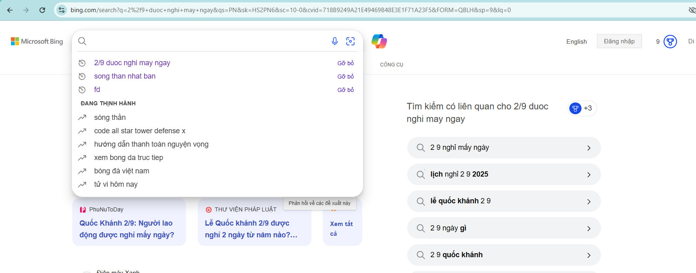

# CEO Crawler

**CEO Crawler** là tiện ích mở rộng Chrome giúp bạn tìm CEO hiện tại của một công ty và thu thập các liên kết mạng xã hội chính thức (LinkedIn, Facebook, X/Twitter) của CEO đó bằng cách tự động tìm kiếm trên Bing và sử dụng AI Google Gemini.

## Tính năng

- Tải lên file CSV chứa danh sách tên công ty.
- Tự động tìm kiếm tên CEO của từng công ty.
- Thu thập và trích xuất liên kết hồ sơ mạng xã hội chính thức của CEO.
- Xuất kết quả ra file CSV.
- Lưu trữ dữ liệu bền vững bằng Chrome local storage.
- Giao diện đơn giản, dễ sử dụng, hiển thị ngay trên trang Bing.

## Cách hoạt động

1. **Tải lên CSV**: Thêm danh sách tên công ty.
2. **Bắt đầu crawl**: Tiện ích tự động tìm kiếm CEO và các liên kết mạng xã hội.
3. **Xuất kết quả**: Tải về file CSV kết quả.
4. **Xóa dữ liệu**: Xóa toàn bộ dữ liệu đã lưu chỉ với một nút bấm.

## Cài đặt

1. Tải về hoặc clone repository này.
2. Mở Chrome và truy cập `chrome://extensions/`.
3. Bật "Chế độ nhà phát triển" (Developer mode).
4. Chọn "Tải tiện ích đã giải nén" (Load unpacked) và chọn thư mục dự án.

## Hướng dẫn lấy API key Google Gemini

1. Truy cập trang [Google AI Studio](https://aistudio.google.com/app/apikey).
2. Đăng nhập bằng tài khoản Google của bạn.
3. Nhấn nút **"Create API key"** (Tạo API key).
4. Sao chép API key vừa tạo.
5. Mở file `background.js` trong thư mục dự án.
6. Thay thế giá trị biến `GEMINI_API_KEY` bằng API key bạn vừa sao chép:

   ```javascript
   const GEMINI_API_KEY = "API_KEY_CỦA_BẠN";
   ```

> **Lưu ý:** Không chia sẻ API key này cho người khác để

## Hướng dẫn sử dụng

1. Truy cập [Bing.com](https://www.bing.com/). và phải ở trang tương tự ảnh để tránh reload trang 
2. Sử dụng giao diện CEO Crawler ở góc dưới bên phải:

   - Tải lên file CSV.
   - Nhấn "Bắt đầu" để bắt đầu crawl.
   - Đợi tool chạy xong.
   - Xuất hoặc xóa kết quả khi cần.

## Cấu trúc thư mục

- `manifest.json` - Cấu hình tiện ích Chrome.
- `background.js` - Xử lý API và giao tiếp.
- `content_script.js` - Chèn UI và tự động hóa tìm kiếm/crawl.
- `style.css` - Giao diện cho UI.

## Quyền truy cập

- `activeTab`, `scripting`, `storage` - Để tương tác với Bing và lưu dữ liệu.
- Quyền truy cập host: `https://www.bing.com/*`.

## Lưu ý

- Cần có API key Google Gemini hợp lệ.
- Chỉ hoạt động trên trang tìm kiếm Bing.
- Dành cho mục đích học tập và nghiên cứu.
- Nếu thấy dữ liệu crawl được không chính xác bạn có thể thay đổi keyword hợp lý để chính xác theo ý của bạn

## Giấy phép

MIT License
